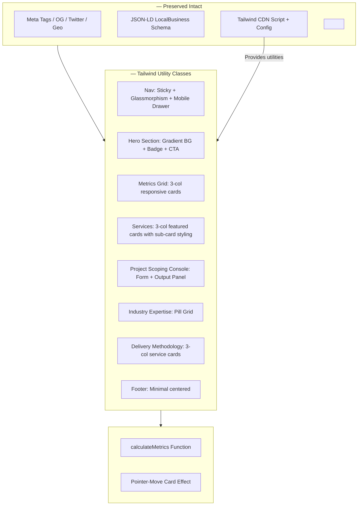
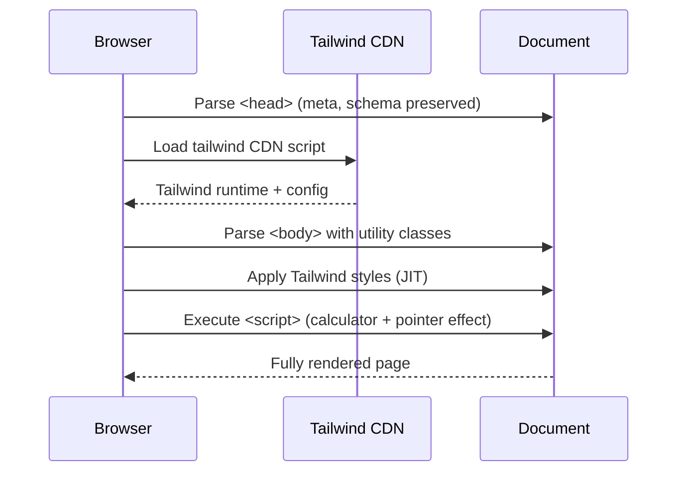
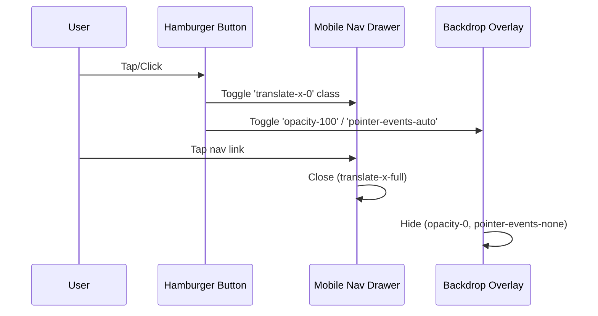

# Design Document: Tailwind Visual Overhaul

## Overview

This feature replaces the existing ~300 lines of embedded custom CSS in `index.html` with Tailwind CSS loaded via CDN, introducing an emerald/slate color scheme, refined spacing, a mobile navigation drawer, and premium B2B sub-card styling for the services section. The transformation is purely visual — all existing meta tags (Open Graph, Twitter Cards, geo, schema.org JSON-LD), the JavaScript calculator (`calculateMetrics`), and the pointer-move card effect remain fully intact and functional.

The approach loads Tailwind CSS Play CDN (`<script src="https://cdn.tailwindcss.com">`) with an inline `tailwind.config` extending the default theme with brand colors (emerald-600/700 primary, slate-800/900 dark accents). Every existing HTML element receives Tailwind utility classes to reproduce and elevate the current design language while removing the `<style>` block entirely.

## Architecture



## Sequence Diagrams

### Page Load Sequence



### Mobile Drawer Interaction



## Components and Interfaces

### Component 1: Tailwind Configuration

**Purpose**: Define brand color palette, font family, and any custom extensions needed beyond Tailwind defaults.

```html
<script src="https://cdn.tailwindcss.com"></script>
<script>
  tailwind.config = {
    theme: {
      extend: {
        colors: {
          brand: {
            50: '#ecfdf5',
            100: '#d1fae5',
            200: '#a7f3d0',
            300: '#6ee7b7',
            400: '#34d399',
            500: '#10b981',
            600: '#059669',
            700: '#047857',
            800: '#065f46',
            900: '#064e3b',
          }
        },
        fontFamily: {
          sans: ['Inter', '-apple-system', 'BlinkMacSystemFont', 'Segoe UI', 'Roboto', 'sans-serif'],
        }
      }
    }
  }
</script>
```

**Responsibilities**:
- Extend Tailwind theme with emerald brand color ramp
- Set Inter as the default sans font family
- Provide consistent design tokens across all components

### Component 2: Navigation (Desktop + Mobile Drawer)

**Purpose**: Sticky top navigation with glassmorphism effect on desktop, hamburger-triggered slide-in drawer on mobile.

**Interface (HTML structure)**:
```html
<nav class="sticky top-0 z-50 backdrop-blur-md bg-white/80 border-b border-slate-100">
  <div class="max-w-7xl mx-auto px-5 py-3.5 flex items-center justify-between">
    <a class="font-extrabold tracking-tight text-slate-900" href="#">Chicago Network Pros</a>
    <!-- Desktop links -->
    <div class="hidden md:flex items-center gap-3">
      <a class="nav-pill" href="#services">Services</a>
      <a class="nav-cta" href="mailto:...">Request Field Dispatch</a>
    </div>
    <!-- Mobile hamburger -->
    <button id="menuBtn" class="md:hidden ...">☰</button>
  </div>
</nav>
<!-- Mobile drawer overlay + panel -->
<div id="drawerOverlay" class="fixed inset-0 bg-slate-900/50 z-40 opacity-0 pointer-events-none transition-opacity"></div>
<div id="drawer" class="fixed top-0 right-0 h-full w-72 bg-white z-50 translate-x-full transition-transform shadow-2xl">
  <!-- Close button + nav links -->
</div>
```

**Responsibilities**:
- Provide accessible navigation on all viewport sizes
- Animate drawer with CSS transitions (translate-x)
- Close drawer on link click, overlay click, or close button

### Component 3: Hero Section

**Purpose**: Full-width gradient hero with badge, heading, subtitle, CTA button, and phone number.

**Responsibilities**:
- Emerald radial gradient background using Tailwind arbitrary values
- Responsive text sizing with Tailwind's responsive prefixes
- CTA button with hover lift effect using `hover:-translate-y-0.5 hover:shadow-xl`

### Component 4: Metrics Grid

**Purpose**: Three equal cards showing key stats with hover glow effect.

**Responsibilities**:
- 3-column grid on desktop, 1-column on mobile (`grid-cols-1 md:grid-cols-3`)
- Each card uses `group` class for hover state coordination
- Pointer-move radial glow preserved via CSS custom properties (existing JS sets `--mx`, `--my`)

### Component 5: Services Section (Premium B2B Sub-Cards)

**Purpose**: 12 featured service cards in a 3-column grid with premium styling.

**Responsibilities**:
- Cards with gradient background (`bg-gradient-to-b from-white to-slate-50`)
- Left emerald accent border (`border-l-4 border-l-brand-500`)
- Subtle shadow escalation on hover (`shadow-md hover:shadow-xl`)
- Icon placeholder area with emerald background circle
- Smooth `transition-all duration-300` for hover transforms

### Component 6: Project Scoping Console

**Purpose**: Interactive calculator with form inputs and live output panel.

**Responsibilities**:
- 2-column layout (inputs left, output right) on desktop; stacks on mobile
- Range sliders and select styled via Tailwind's `accent-brand-500` and form utilities
- Output panel with card styling and highlighted stat values in emerald

### Component 7: Industry Expertise Pills

**Purpose**: Grid of 16 industry vertical pills.

**Responsibilities**:
- 4-column grid on desktop, 2-column on mobile (`grid-cols-2 md:grid-cols-4`)
- Pill shape with `rounded-full` and subtle border
- Hover state with emerald background tint

### Component 8: Enterprise Delivery Methodology

**Purpose**: 6 methodology cards in 3-column grid.

**Responsibilities**:
- Similar card styling to services but without accent border
- Numbered or icon-driven visual hierarchy
- Hover lift animation

## Data Models

### Color Palette (Design Tokens)

| Token | Hex Value | Tailwind Class | Usage |
|-------|-----------|----------------|-------|
| Primary | #059669 | `text-brand-600` | CTA text, highlights, links |
| Primary Dark | #047857 | `text-brand-700` | Hover states |
| Primary Light | #ecfdf5 | `bg-brand-50` | Badge background, tints |
| Slate Dark | #0f172a | `text-slate-900` | Headings, body text |
| Slate Medium | #475569 | `text-slate-600` | Subtitles, descriptions |
| Slate Light | #f8fafc | `bg-slate-50` | Card backgrounds |
| Border | #e2e8f0 | `border-slate-200` | Card borders, dividers |

### Breakpoint Strategy

| Breakpoint | Tailwind Prefix | Behavior |
|------------|-----------------|----------|
| < 768px | (default) | Single-column, mobile drawer, stacked cards |
| ≥ 768px | `md:` | Multi-column grids, desktop nav |
| ≥ 1024px | `lg:` | Wider spacing, larger text sizes |
| ≥ 1280px | `xl:` | Max-width container constrains content |

## Algorithmic Pseudocode

### Mobile Drawer Toggle Algorithm

```pascal
ALGORITHM toggleMobileDrawer()
INPUT: click event on hamburger button or overlay or close button
OUTPUT: drawer visibility state change

BEGIN
  drawer ← document.getElementById('drawer')
  overlay ← document.getElementById('drawerOverlay')
  
  IF drawer HAS CLASS 'translate-x-full' THEN
    // Open drawer
    REMOVE 'translate-x-full' FROM drawer
    ADD 'translate-x-0' TO drawer
    REMOVE 'opacity-0' FROM overlay
    ADD 'opacity-100' TO overlay
    REMOVE 'pointer-events-none' FROM overlay
    ADD 'pointer-events-auto' TO overlay
  ELSE
    // Close drawer
    REMOVE 'translate-x-0' FROM drawer
    ADD 'translate-x-full' TO drawer
    REMOVE 'opacity-100' FROM overlay
    ADD 'opacity-0' TO overlay
    REMOVE 'pointer-events-auto' FROM overlay
    ADD 'pointer-events-none' TO overlay
  END IF
END
```

**Preconditions:**
- DOM elements 'drawer' and 'drawerOverlay' exist in the document
- Tailwind CSS is loaded and utility classes are available

**Postconditions:**
- Drawer is either fully visible (translate-x-0) or fully hidden (translate-x-full)
- Overlay matches drawer state (visible/hidden)
- Transition animations fire due to `transition-transform` and `transition-opacity` classes

### CSS Removal & Replacement Algorithm

```pascal
ALGORITHM replaceCSSWithTailwind()
INPUT: index.html with embedded <style> block
OUTPUT: index.html with Tailwind CDN + utility classes, no <style> block

BEGIN
  // Step 1: Preserve all non-CSS head content
  preservedHead ← EXTRACT(meta tags, schema scripts, title, canonical, OG tags)
  
  // Step 2: Insert Tailwind CDN script and config
  INSERT tailwindCDNScript INTO <head> AFTER preservedHead
  INSERT tailwindConfig INTO <head> AFTER tailwindCDNScript
  
  // Step 3: Add minimal custom style block for non-Tailwind needs
  INSERT <style type="text/tailwindcss"> WITH:
    - Custom scrollbar styling (if needed)
    - Range input thumb styling (browser-specific)
    - Radial gradient hover effect for metric cards (--mx, --my variables)
  
  // Step 4: For each HTML element in <body>
  FOR EACH element IN document.body DO
    currentCSS ← GET computed styles from removed <style> block
    tailwindClasses ← MAP currentCSS TO equivalent Tailwind utilities
    SET element.className = tailwindClasses
  END FOR
  
  // Step 5: Add mobile drawer HTML structure
  INSERT hamburger button INTO nav (visible only on mobile: md:hidden)
  INSERT drawer overlay div AFTER nav
  INSERT drawer panel div AFTER overlay
  
  // Step 6: Add drawer toggle script
  INSERT drawer JavaScript BEFORE existing calculator script
  
  // Step 7: Verify preserved elements
  ASSERT all meta tags present AND unchanged
  ASSERT JSON-LD script present AND unchanged
  ASSERT calculateMetrics function present AND unchanged
  ASSERT pointermove event listeners present AND unchanged
  
  // Step 8: Remove old <style> block
  DELETE <style>...</style> FROM <head>
  
  RETURN modified index.html
END
```

**Preconditions:**
- index.html exists with embedded `<style>` block
- All meta tags and schema scripts are identified and marked for preservation
- Tailwind CDN URL is accessible

**Postconditions:**
- No `<style>` block remains (except minimal `<style type="text/tailwindcss">` for edge cases)
- All visual styles are applied via Tailwind utility classes
- Site renders identically or better than before at all breakpoints
- All JavaScript functionality is preserved
- All SEO elements are preserved

## Key Functions with Formal Specifications

### Function: initDrawer()

```javascript
function initDrawer() {
  const btn = document.getElementById('menuBtn');
  const drawer = document.getElementById('drawer');
  const overlay = document.getElementById('drawerOverlay');
  const closeBtn = document.getElementById('drawerClose');
  
  const open = () => { /* toggle classes */ };
  const close = () => { /* toggle classes */ };
  
  btn.addEventListener('click', open);
  overlay.addEventListener('click', close);
  closeBtn.addEventListener('click', close);
  drawer.querySelectorAll('a').forEach(a => a.addEventListener('click', close));
}
```

**Preconditions:**
- DOM is fully loaded (script at bottom of body or DOMContentLoaded)
- Elements with IDs 'menuBtn', 'drawer', 'drawerOverlay', 'drawerClose' exist

**Postconditions:**
- Click on hamburger opens drawer with smooth slide-in animation
- Click on overlay, close button, or any nav link closes drawer
- No memory leaks (event listeners attached once)

**Loop Invariants:** N/A

### Function: calculateMetrics() (PRESERVED — no changes)

```javascript
function calculateMetrics() {
  // Existing logic unchanged
  // Reads scale, racks, cables from DOM
  // Computes hours, crew size, tools
  // Updates output panel text
}
```

**Preconditions:**
- DOM elements with IDs 'projectScale', 'rackCount', 'cableZen' exist
- Output elements 'outHours', 'outCrew', 'outTools' exist

**Postconditions:**
- Output values reflect current input state
- No side effects beyond updating DOM text content

## Example Usage

### Tailwind CDN Integration in `<head>`

```html
<head>
    <!-- All existing meta tags preserved exactly as-is -->
    <meta charset="UTF-8">
    <meta name="viewport" content="width=device-width, initial-scale=1.0">
    <title>Chicago Network Pros | Enterprise IT &amp; Network Infrastructure Services in Chicago IL</title>
    <!-- ... all other meta, OG, Twitter, geo tags ... -->
    
    <!-- JSON-LD Schema preserved exactly as-is -->
    <script type="application/ld+json">{ ... }</script>
    
    <!-- NEW: Tailwind CSS via CDN -->
    <script src="https://cdn.tailwindcss.com"></script>
    <script>
      tailwind.config = {
        theme: {
          extend: {
            colors: {
              brand: {
                50: '#ecfdf5', 100: '#d1fae5', 200: '#a7f3d0',
                300: '#6ee7b7', 400: '#34d399', 500: '#10b981',
                600: '#059669', 700: '#047857', 800: '#065f46', 900: '#064e3b'
              }
            },
            fontFamily: {
              sans: ['Inter', '-apple-system', 'BlinkMacSystemFont', 'Segoe UI', 'Roboto', 'sans-serif']
            }
          }
        }
      }
    </script>
    
    <!-- Minimal custom styles for things Tailwind can't handle inline -->
    <style type="text/tailwindcss">
      @layer utilities {
        .card-glow::before {
          content: "";
          @apply absolute inset-0 rounded-xl opacity-0 transition-opacity duration-400 pointer-events-none;
          background: radial-gradient(600px circle at var(--mx, 50%) var(--my, 50%), rgba(16,185,129,0.10), transparent 40%);
        }
        .card-glow:hover::before {
          @apply opacity-100;
        }
      }
      input[type="range"] { @apply appearance-none h-1.5 bg-slate-200 rounded-full; }
      input[type="range"]::-webkit-slider-thumb {
        @apply appearance-none h-4.5 w-4.5 rounded-full bg-slate-900 border-2 border-white shadow-lg cursor-pointer;
      }
    </style>
    
    <!-- OLD <style> block REMOVED entirely -->
</head>
```

### Premium Service Card Example

```html
<div class="bg-gradient-to-b from-white to-slate-50 p-6 rounded-xl border border-slate-200 border-l-4 border-l-brand-500 shadow-md hover:shadow-xl hover:-translate-y-0.5 transition-all duration-300">
  <h3 class="text-lg font-extrabold text-slate-900 mt-0 mb-2">Data Center Services</h3>
  <p class="text-slate-600 text-sm leading-relaxed mb-0">AI-ready and hyperscale data center build-out, cabling, and infrastructure services...</p>
</div>
```

### Mobile Navigation Drawer Example

```html
<!-- Hamburger (mobile only) -->
<button id="menuBtn" class="md:hidden p-2 rounded-lg hover:bg-slate-100 transition-colors" aria-label="Open menu">
  <svg class="w-6 h-6 text-slate-700" fill="none" stroke="currentColor" viewBox="0 0 24 24">
    <path stroke-linecap="round" stroke-linejoin="round" stroke-width="2" d="M4 6h16M4 12h16M4 18h16"/>
  </svg>
</button>

<!-- Overlay -->
<div id="drawerOverlay" class="fixed inset-0 bg-slate-900/50 backdrop-blur-sm z-40 opacity-0 pointer-events-none transition-opacity duration-300"></div>

<!-- Drawer Panel -->
<div id="drawer" class="fixed top-0 right-0 h-full w-72 bg-white z-50 shadow-2xl translate-x-full transition-transform duration-300 ease-in-out p-6">
  <button id="drawerClose" class="absolute top-4 right-4 p-2 rounded-lg hover:bg-slate-100" aria-label="Close menu">
    <svg class="w-5 h-5 text-slate-600" fill="none" stroke="currentColor" viewBox="0 0 24 24">
      <path stroke-linecap="round" stroke-linejoin="round" stroke-width="2" d="M6 18L18 6M6 6l12 12"/>
    </svg>
  </button>
  <nav class="mt-12 flex flex-col gap-4">
    <a href="#services" class="text-lg font-semibold text-slate-800 hover:text-brand-600 transition-colors">Services</a>
    <a href="mailto:dispatch@chicagonetworkpros.com" class="mt-4 block text-center bg-slate-900 text-white py-3 px-4 rounded-full font-bold hover:bg-slate-800 transition-colors">Request Field Dispatch</a>
  </nav>
</div>
```

## Correctness Properties

The following properties must hold true after the migration:

1. **∀ meta tags m ∈ original `<head>`: m exists unchanged in new `<head>`**
   - All Open Graph, Twitter Card, geo, robots, and verification meta tags preserved byte-for-byte

2. **∀ JSON-LD scripts s ∈ original `<head>`: s exists unchanged in new `<head>`**
   - LocalBusiness schema script preserved with identical content

3. **∀ viewport widths w ∈ [320px, 1920px]: page renders without horizontal overflow**
   - No content bleeds outside viewport at any standard device width

4. **calculateMetrics() produces identical outputs for identical inputs before and after migration**
   - Function logic, DOM element IDs, and output format unchanged

5. **∀ service cards c: c has visible emerald left accent border AND hover elevation effect**
   - Premium B2B sub-card styling applied consistently to all 12 featured cards

6. **Mobile drawer opens on hamburger click AND closes on overlay/close/link click**
   - Drawer transitions smoothly without layout shift

7. **No custom `<style>` block exists with raw CSS declarations**
   - Only `<style type="text/tailwindcss">` for Tailwind `@layer` directives is acceptable

8. **Pointer-move radial glow effect on metric cards functions identically**
   - `--mx` and `--my` CSS custom properties still drive the glow position

## Error Handling

### Error Scenario 1: Tailwind CDN Unavailable

**Condition**: CDN script fails to load (network error, CDN outage)
**Response**: Page renders with browser defaults (unstyled but readable)
**Recovery**: Content remains accessible; meta tags and JS still functional. Consider adding a `<noscript>` fallback note or inlining critical layout styles as a future enhancement.

### Error Scenario 2: JavaScript Disabled

**Condition**: User has JavaScript disabled
**Response**: Tailwind CDN (which is JS-based) won't apply styles; calculator won't function
**Recovery**: All content remains in semantic HTML and is readable. Links and contact info remain accessible. This is an existing constraint of the Tailwind Play CDN approach.

### Error Scenario 3: Mobile Drawer State Conflict

**Condition**: Rapid repeated taps on hamburger button
**Response**: CSS transition handles state; only final state matters
**Recovery**: `translate-x-full` vs `translate-x-0` is binary — no intermediate broken state possible with class toggling.

## Testing Strategy

### Unit Testing Approach

- Verify all meta tags present in `<head>` by parsing HTML
- Verify JSON-LD script content matches original
- Verify `calculateMetrics()` output for known input combinations
- Verify no `<style>` block with raw CSS exists (only `type="text/tailwindcss"` allowed)

### Visual Regression Testing

- Screenshot comparison at 375px (mobile), 768px (tablet), 1440px (desktop)
- Verify emerald color scheme visible in hero badge, CTA buttons, metric numbers, card accents
- Verify mobile drawer animation renders correctly
- Verify service cards display left accent border

### Accessibility Testing

- Verify all interactive elements have proper `aria-label` attributes
- Verify color contrast ratios meet WCAG AA (emerald-600 on white = 4.5:1+)
- Verify keyboard navigation works for drawer open/close
- Verify focus trapping inside open drawer

### Cross-Browser Testing

- Chrome, Firefox, Safari, Edge (latest versions)
- iOS Safari, Android Chrome (mobile)
- Verify `backdrop-filter` works or degrades gracefully

## Performance Considerations

- **Tailwind CDN Size**: Play CDN is ~300KB JS (not ideal for production); acceptable for this single-page site with no build step
- **No FOUC**: Tailwind CDN script in `<head>` applies styles before body renders
- **Transition Performance**: All animations use `transform` and `opacity` (GPU-composited, no layout thrashing)
- **Image Optimization**: No images currently in use; SVG icons are inline and lightweight
- **Font Loading**: Inter font assumed available via system or future `<link>` addition; fallback stack ensures no layout shift

## Security Considerations

- **CDN Integrity**: Consider adding `integrity` and `crossorigin` attributes to CDN script tag if Tailwind provides SRI hashes
- **No User Input Rendering**: Calculator outputs are set via `innerText` (not `innerHTML`), preventing XSS
- **Email `mailto:` Links**: Already sanitized, no change needed
- **External Script**: Single external dependency (cdn.tailwindcss.com) — trusted source maintained by Tailwind Labs

## Dependencies

| Dependency | Version | Purpose | Source |
|------------|---------|---------|--------|
| Tailwind CSS Play CDN | Latest (auto) | Utility-first CSS framework | `https://cdn.tailwindcss.com` |
| Inter Font | System / CDN | Primary typeface | System font stack (existing) |
| No build tools | — | Single HTML file, no bundler needed | — |
